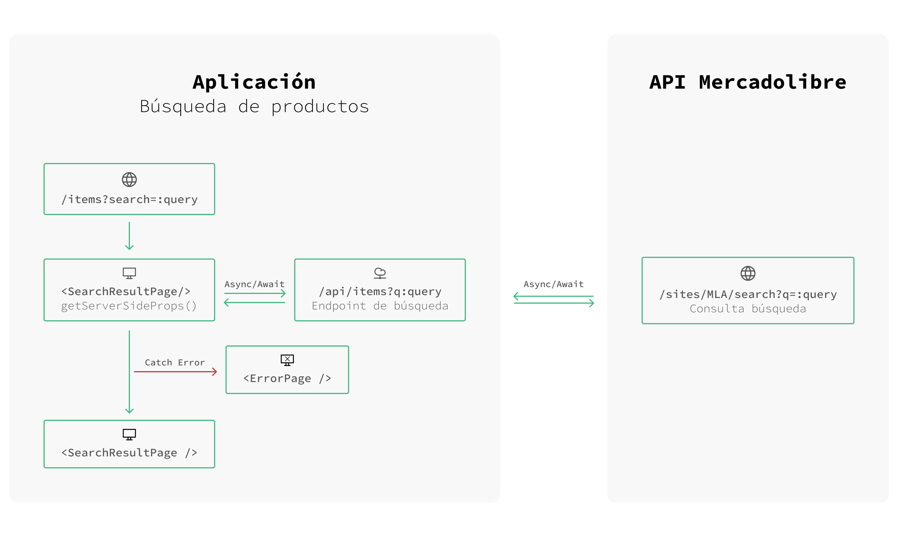
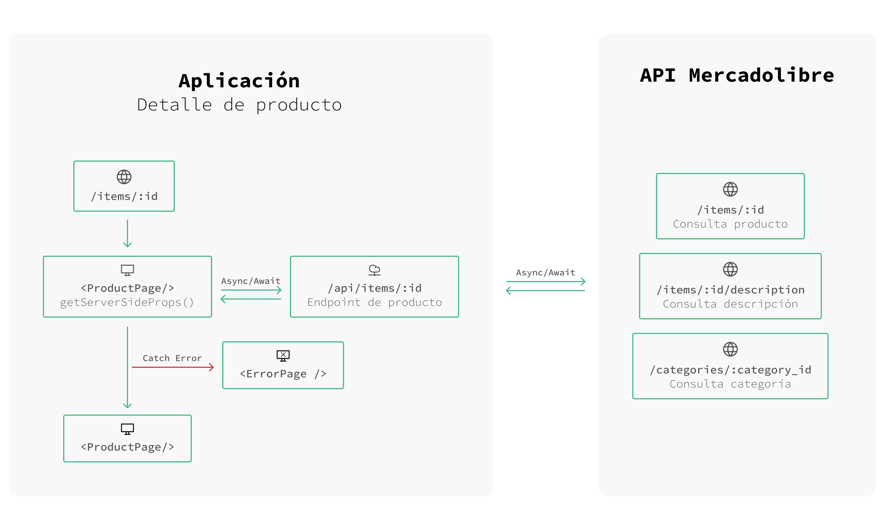

# Sebastián Tamashiro - Challenge Frontend 2021

## Inicialización del proyecto

Para inicializar el proyecto se recomienda utilizar `docker` porque facilita todas las configuraciones necesarias para comenzar a desarrollar.

```bash
docker-compose up --build
```

## Configuración manual

Requerimientos:

- jq
- envsubst

Otra forma de inicializar el proyecto es con `npm`. Con este se deberá instalar las dependencias, solicitar un nuevo `ACCESS_TOKEN` y levantar el entorno en modo desarrollo.

```bash
npm install
npm run refresh_token
npm run dev
```

## Arquitectura general




**Documentación completa del proyecto:** [Documentación - Sebastián Tamashiro - Challenge Frontend 2021](https://alotama.github.io/fantastic-garbanzo/#/)